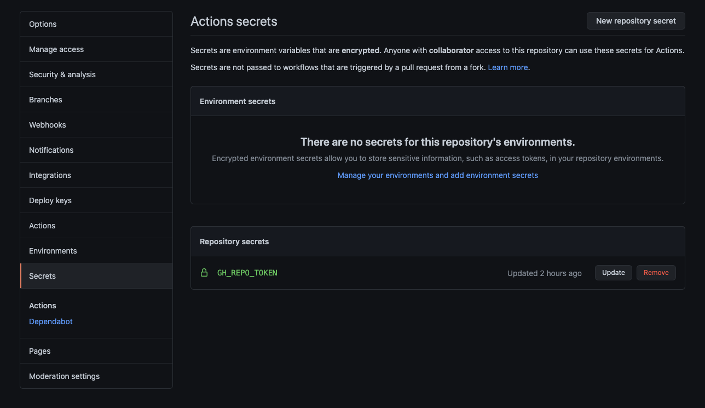

# Parcel Web Template

A lightweight HTML, CSS, and JS boilerplate bundled with [Parcel.js](https://parceljs.org/)
and pre-configured for deployments to [GitHub Pages](https://pages.github.com/).

## Setup & Prerequisites

This repository assumes you have Node.js running locally on your computer. This repository was built
using Node `v16`, though it is likely to work on earlier version of Node. You can determine which
version of Node you are running by running `node -v` in your terminal. If you have an earlier version
and would like to upgrade, [NVM - Node Version Manager](https://github.com/nvm-sh/nvm) is a highly
recommended configuration.

### GitHub Personal Access Token (PAT)

If you don't need / want deployments to GitHub Pages, feel free to skip this step and delete the
[deploy.yml](./.github/workflows/deploy.yml) file.

To leverage deployments to GitHub Pages, this repository assumes you are leveraging GitHub's 2FA,
which requires you have a GitHub Personal Access Token (PAT). To create a PAT,
[follow these steps](https://docs.github.com/en/github/authenticating-to-github/keeping-your-account-and-data-secure/creating-a-personal-access-token)
and create a token with the `repo` permissions.

**Note:** Make sure you save your token somewhere secure, as you will need it for setup in the
next section. If you lose it, you will need to re-generate a new token. Additionally, a PAT allows
administrative access to parts of your GitHub account. **Do not** include a PAT anywhere in this
repository or somewhere where it can be discovered by anyone else.

## Usage

### Repository Setup

Click the "Use This Template" button within this repository to create a repository based on this
repository. After your repository is created, head to the Settings section within GitHub, and
locate the Secrets section. Click "New repository secret" and add a new secret with the name
`GH_REPO_TOKEN` and the value of your Personal Access Token.



This step will create an environment variable that will be leveraged during the deployment step
of the GitHub Action workflow that is included with this template. As it is an environment secret,
it is encrypted and not passed to any other parts of this codebase that are publicly accessible.

If you do not have a Personal Access Token, be sure to follow the steps outlined in the above
section.

### Installation

Once your repository is created and your token is added to your secrets, clone down your
repository and run the following to install your dependencies:

Using NPM:
```bash
npm install
```

Using Yarn:
```bash
yarn
```

Once installed, run either `npm run dev` or `yarn dev` to build and serve the app. If setup was
successful, you should see a confirmation in your terminal that a server is running at
[http://localhost:3000](http://localhost:3000). This `dev` command leverages
[Parcel's](https://parceljs.org/getting_started.html) development server, and will automatically
watch and rebuild your app as you make modifications.

**Note:** By default, the app is set to run on port 3000. If you would like the app to run on a
different port, feel free to specify the new port number within the `dev` command of your
[package.json](./package.json) file.

```json
"dev": "parcel ./src/* -p 3000",
```

## Example files

This project comes bootstrapped with the following simple example HTML project structure within the
`src` directory:

```
- src
  - index.html
  css
    - normalize.css
    - index.css
  js
    - index.js
```

*Note: `normalize.css` is not meant to be modified. It is included to migitate many style conflicts
and cross-browser discrepancies. Feel free to remove it or completely change the file structure
entirely if it does not serve your purpose, but please note that major changes to the directory
structure may require you to update the `dev` and `build` commands located in the
[package.json](./package.json) file.

## GitHub Actions / Continuous Integration (CI)

This project also comes bootstrapped with a series of automated [GitHub Actions](https://github.com/features/actions)
workflows that will run the following commands under their respective circumstances:

### Pull Requests

On Pull Requests to the `main` branch, a GitHub Action will run that will checkout the branch,
install the dependencies, and run the build command `npm run build`, to ensure no build errors
are taking place.

In the future, if you would like to add a testing suite like Jest to this template, it would be
appropriate to add a step in this workflow to run said tests within the GitHub Action

### Deployments

On commits or merges into the `main` branch, a GitHub Action will run that will checkout the branch,
install the dependencies, run the build command via `npm run build`, and then deploy the code to
GitHub Pages via this open source [GitHub Action](https://github.com/crazy-max/ghaction-github-pages).

If you don't need / want deployments to GitHub pages, please feel free to delete the
[deploy.yml](./.github/workflows/deploy.yml) file.
